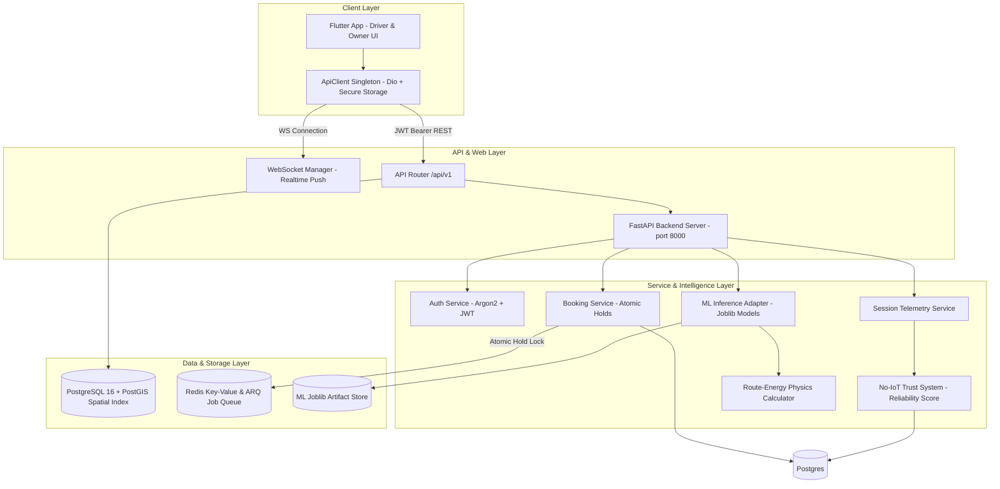

# VoltEZ — Next-Gen EV Charging & Decision-Intelligence Platform

[](https://fastapi.tiangolo.com)
[](https://postgis.net)
[](https://python.org)
[](https://flutter.dev)
[](#audit-verification--test-results)

VoltEZ is an end-to-end EV charging discovery, atomic reservation, session telemetry, and machine-learning decision-intelligence platform. It bridges driver mobile UX with commercial charger station owners through real-time geospatial search, route-energy physics math, dynamic demand forecasting, and zero-trust reliability scoring.

---

## 🏛️ System Architecture



---

## ⚡ Core Features & Key Workflows

### 🚗 EV Driver Flow
- **Geospatial Station Discovery**: Instant PostGIS radius search (`ST_DWithin`) filtering compatible connector types and active ports.
- **Route-Energy Physics Assessment**: Computes aerodynamic drag, rolling resistance, climbing elevation, and battery State of Charge (SoC) reserve to calculate real-world reachability before sending the driver to a charger.
- **Dynamic ML Wait-Time Prediction**: ML Model 2 predicts port occupancy probability at ETA and returns calibrated congestion levels (`LOW`, `MEDIUM`, `HIGH`).
- **Atomic 10-Minute Reservation Holds**: Prevents double-booking via Redis key locks (`set(lock_key, user_id, nx=True, ex=600)`). If unpaid, background ARQ workers automatically expire the slot.
- **Session Check-In & Telemetry**: Drivers check in upon arrival and complete sessions with server-side pricing verification. Physical charger/OCPP telemetry is an explicit production integration still to be added.
- **No-IoT Trust System**: Drivers can report broken chargers, instantly penalizing station reliability scores by 20% to prevent bad recommendations for other users.
- **Razorpay Payment Integration**: Integrated order creation and HMAC-SHA256 signature verification webhooks.

### 🏢 Charger Station Owner Flow
- **Business Location Profiles**: Register commercial locations with PostGIS geography coordinates.
- **Charger & Port Management**: Dynamic station capacity configuration (AC/DC power kW ratings, connector types).
- **AI Intelligence & Dynamic Pricing**: ML Model 1 (Demand Forecasting) analyzes historical demand windows to recommend off-peak discounts or peak pricing strategies.
- **Live Notifications**: Real-time in-app updates via WebSockets; the FCM adapter currently persists notifications and logs a development mock until Firebase credentials/provider delivery are configured.

---

## 🤖 Machine Learning Intelligence Suite

| Track | Model Name | Algorithm | Features | Metrics / Performance | Deployment Stage |
| :--- | :--- | :--- | :---: | :--- | :--- |
| **Model 1** | Demand Forecasting | Histogram Gradient Boosting (Poisson) | 52 | **MAE 0.739**, RMSE 0.990, 75.89% within 1 request | `synthetic_validated` |
| **Model 2** | Charger Availability | Calibrated Histogram Gradient Boosting | 35 | **ROC-AUC 0.809**, 94.67% accuracy on binary decisions | `shadow` |
| **Model 3** | Waiting-Time Predictor | Quantile Regression | 35 | Calibrated queue wait estimation in minutes | `serving_ready` |
| **Model 4** | Reliability Score | Weighted Historical Evidence | 18 | No-IoT Bayesian reliability score (0-100) | `serving_ready` |
| **Model 5** | Route-Energy Physics | First-Principles Drag + Mass Solver | Native | Physics force equation for exact kWh reachability | `live_embedded` |

---

## 🛠️ Technology Stack

- **Backend Framework**: Python 3.12+ with [FastAPI](https://fastapi.tiangolo.com/) & Uvicorn
- **Database & Spatial**: PostgreSQL 16 with [PostGIS](https://postgis.net/) spatial index, SQLAlchemy 2.0 (AsyncIO), GeoAlchemy2
- **Cache & Async Worker Queue**: Redis 7 & [ARQ](https://github.com/samuelcolvin/arq)
- **Machine Learning**: `scikit-learn`, `joblib`, `pandas`, `numpy`, `polars`
- **Security & Auth**: Argon2 (`passlib`), PyJWT / `python-jose`, OAuth2 Bearer Tokens
- **Frontend App**: Flutter 3.x (Dart), Dio HTTP Client with automatic token refresh queue, FlutterSecureStorage

---

## 📊 Audit Verification & Test Results

An end-to-end architecture and integration audit was completed across all backend endpoints, database schemas, and frontend API services.

### 🔍 Verification Highlights
- **FastAPI deployment stack**: PostGIS + Redis + Alembic + API + ARQ worker start successfully; `/health/ready` reports database, Redis, and ML checks (**PASS**).
- **ML suite**: `133 passed` (**100% PASS**).
- **Backend integration suite**: `6 passed` against local PostGIS/Redis (**PASS**).
- **Flutter client**: analyzer reports no issues, `4` widget tests pass, and the release web bundle builds (**PASS**).
- **Pydantic V2 Migration**: All response models updated to `model_config = ConfigDict(from_attributes=True)`.
- **Database Model Integrity**: All 24 SQLAlchemy ORM models verified and registered in `database/base.py`.

---

## 🚀 Quickstart & Installation Guide

### Prerequisites
- Python 3.12
- PostgreSQL 16+ with PostGIS extension enabled (`CREATE EXTENSION postgis;`)
- Redis 7+
- Flutter SDK (for mobile app)

### 1. Backend Setup

```bash
# From the repository root
cp .env.example .env
python3.12 -m venv .venv
source .venv/bin/activate  # On Windows: .venv\Scripts\Activate.ps1
pip install -r backend/requirements.txt
pip install -e .
```

Ensure `.env` contains your PostgreSQL and Redis connections:
Use `.env.example` as the single variable contract. In particular, local
Compose uses `postgresql+psycopg://...@postgres:5432/voltez` inside containers;
direct host Uvicorn uses the host database URL from `backend/.env.example`.

### 2. Run Database Migrations

```bash
alembic upgrade head
alembic check
```

### 3. Start API Server & Worker

```bash
# Recommended: start PostGIS, Redis, migration, API, and worker together
/opt/homebrew/bin/docker-compose up -d --build

# Or run API/worker directly after starting Postgres and Redis
PYTHONPATH=backend:src uvicorn app.main:app --host 0.0.0.0 --port 8000
PYTHONPATH=backend:src arq app.worker.WorkerSettings
```

API Documentation will be live at:
- **Swagger UI**: [http://localhost:8000/docs](http://localhost:8000/docs)
- **ReDoc**: [http://localhost:8000/redoc](http://localhost:8000/redoc)

### 4. Frontend Mobile App Setup

```bash
flutter pub get
flutter run -d chrome \
  --dart-define=API_BASE_URL=http://127.0.0.1:8000/api/v1 \
  --dart-define=WS_BASE_URL=ws://127.0.0.1:8000/api/v1
```

For native phone setup and LAN/HTTPS configuration, see
[`docs/DEPLOYMENT_AND_PHONE_TESTING.md`](docs/DEPLOYMENT_AND_PHONE_TESTING.md).

### 5. Run on a physical Android phone (USB)

Start the API stack first, connect the unlocked phone with USB debugging
enabled, and accept the RSA authorization prompt. Then run the canonical
phone runner from the repository root:

```bash
/opt/homebrew/bin/docker-compose up -d --build
./scripts/run_phone.sh
```

The script discovers the Android SDK, verifies an authorized `adb` device,
configures `adb reverse tcp:8000 tcp:8000`, and launches Flutter with the API
set to `http://127.0.0.1:8000/api/v1`. This reverse tunnel is required because
`127.0.0.1` on a physical phone means the phone itself. If the phone and Mac
are on the same Wi-Fi instead, use `./scripts/run_phone.sh --lan`; the script
passes the Mac LAN address to Flutter. Do not run a plain physical-device
`flutter run` with the default localhost URL unless the reverse tunnel is
already active.

---

## 📂 Project Structure

```
VoltEZ/
├── backend/
│   ├── app/
│   │   ├── api/v1/          # REST routes (auth, booking, charger, sessions, etc.)
│   │   ├── core/            # Config, security (Argon2/JWT), error handling
│   │   ├── db/              # Async SQLAlchemy session factory
│   │   ├── ml/              # ML adapters & feature pipeline builders
│   │   ├── repositories/    # Async CRUD repository pattern
│   │   ├── schemas/         # Pydantic V2 request & response schemas
│   │   ├── services/        # Business logic domain services
│   │   ├── websockets/      # Real-time WebSocket connection manager
│   │   ├── main.py          # FastAPI application entry point & lifespan
│   │   └── worker.py        # ARQ Redis background job worker
│   └── requirements.txt
├── database/
│   ├── models/              # SQLAlchemy 2.0 ORM DB Models (24 models)
│   ├── base.py              # Centralized Declarative Base model registry
│   └── session.py           # Sync DB connection session maker
├── lib/
│   ├── core/                # App config & environment constants
│   ├── models/              # Dart data models
│   ├── screens/             # Flutter UI screens (Explore, Bookings, Dashboard)
│   └── services/            # API Client singleton, Auth & Profile services
├── models/                  # Trained Joblib ML model bundles
├── src/voltez_ml/           # Core ML package (training, features, evaluation)
├── tests/                   # ML core test suite (133 unit tests)
├── alembic/                 # Database migration scripts
├── docker-compose.yml       # Infrastructure orchestration
└── README.md
```

---

## 📜 License & Author

Built with ❤️ by the VoltEZ Team for next-generation EV mobility.
